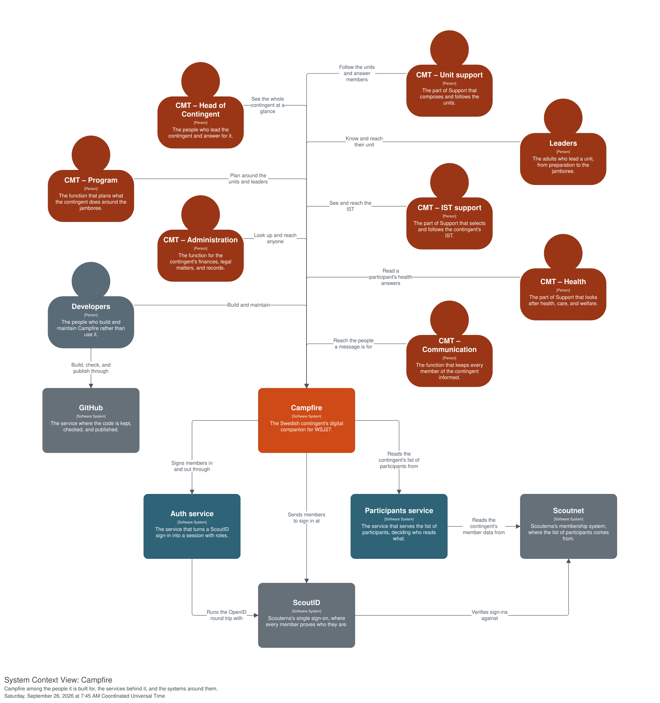

# WSJ27 Campfire

Campfire is a digital companion for **Scouterna's Swedish contingent to the World Scout Jamboree 2027 (WSJ27)** in Gdansk, Poland – the roughly 2,600-person delegation of participants, leaders, International Service Team (IST), and contingent management traveling to the camp. Its users are the people running that delegation – the leaders and the contingent management team (CMT) – not the participants. The first feature is that leaders see the participants in their units, with status reporting and lightweight issue tracking as the next anchors; broader communication takes place on Discord.

This repository holds the front-end: one React web application, and the two thin native shells – Android in Kotlin, Apple in Swift – that host it on a phone. The back-end services are Python, each in its own repository and deployed on its own.



## Start with the guidebook

Campfire is built on decisions made explicitly and written down, and that documentation is the source of truth for the people and the AI agents working here. Most of it is the **software guidebook**, published at **[scouterna.github.io/wsj27-campfire](https://scouterna.github.io/wsj27-campfire/)** and read locally beside the code:

```sh
pnpm install          # dependencies and the git hooks – the only setup step
pnpm start:guidebook  # the guidebook at http://localhost:3001
```

Read from the Introduction outward. The three written records behind it, all under `docs/`:

- **[Software guidebook](docs/guidebook/index.md)** – the living description of the system: its context, requirements, architecture, process, and testing. It describes Campfire as its first version is built, and says plainly what is still open.
- **[Architecture Decision Records](docs/decisions/index.md)** – every significant decision with its context and trade-offs, as a numbered record. A record can be rewritten until it is pushed; after that, a decision that changes is superseded by a new one.
- **[The architecture model](docs/architecture/AGENTS.md)** – the C4 model as Structurizr DSL, from which every diagram in the guidebook is rendered. Working on it needs Docker.

## Building and running

Node.js 24 and pnpm build the web application and the tooling; the shells need Xcode and the Android SDK on top, `pnpm start:local` wants Caddy, and the container environments want Docker, all installed out of band – [Setting up](docs/guidebook/development/setup.md) is the full list. Every operation is a named root script, so nothing is run from inside a platform directory.

```sh
pnpm start:local      # the whole app on http://localhost:8000, with the mock back-end
pnpm start:web        # the web application's dev server alone, on port 3000
pnpm start:storybook  # every component, widget, and screen, on port 3002
pnpm start:apple      # build, install, and launch the Apple shell on a Simulator
pnpm start:android    # the same on an emulator
```

Campfire runs in three environments – local, dev, and prod – and they differ in one thing: what sits behind the back-end paths. All three serve the same origin, `http://localhost:8000`, so the web application and the shells never learn which one is running. [The scripts](docs/guidebook/development/scripts.md) lists every script.

Before work leaves the machine it passes `pnpm test` and [the checks](docs/guidebook/development/checks.md) – `pnpm check:format`, `check:lint`, `check:markdown`, and `check:types` for the shared layer, `check:apple:*` and `check:android:*` for the native code, each run separately so one pass reports every failure. The `pre-push` hook runs them, and [GitHub Actions](docs/guidebook/development/continuous-integration.md) runs them again on every pull request.

## Repository layout

- `apps/` – the deployable apps: the React web application, and the Android and Apple shells that host it
- `libraries/` – generic, reusable packages: `host` (which tier the application runs in), `ui` (the design system), `utils`
- `modules/` – feature modules, each a domain capability: `authentication`, `home`, `journey`, `participants`
- `tools/` – development tooling that ships to nobody, starting with the mock back-end
- `config/` – shared tooling configuration, one directory per tool, plus the three environments
- `scripts/` – the scripts behind the `pnpm` scripts: the start scripts under `start/`, the shells' own under `android/` and `apple/`, the Structurizr runner under `structurizr/`, and the version rule under `release/`
- `docs/` – the decision log, the software guidebook, and the C4 architecture model
- `.agents/` – the agent definitions, the skills, and the per-branch spec scratch

Every workspace package exports raw TypeScript source, so nothing under `libraries/` or `modules/` has a build step of its own – Vite compiles them together with the app. [Repository layout](docs/guidebook/development/layout.md) says where it all sits.

## How work happens

Most of the work is done by AI agents – an analyst, an architect, a developer, and a reviewer – each with one job and a human deciding at every handoff. The [Process chapter](docs/guidebook/process/index.md) is the shape of it. [`AGENTS.md`](AGENTS.md) is the operational detail and every agent's entry point, and it routes to the files beside the code: [`apps/web/AGENTS.md`](apps/web/AGENTS.md), [`apps/apple/AGENTS.md`](apps/apple/AGENTS.md), [`apps/android/AGENTS.md`](apps/android/AGENTS.md), [`modules/AGENTS.md`](modules/AGENTS.md), [`libraries/AGENTS.md`](libraries/AGENTS.md), [`tools/mock/AGENTS.md`](tools/mock/AGENTS.md), [`docs/AGENTS.md`](docs/AGENTS.md), and [`docs/architecture/AGENTS.md`](docs/architecture/AGENTS.md). Each `CLAUDE.md` is a symlink to the `AGENTS.md` beside it.

Work is tracked as GitHub issues. Commits are Conventional Commits without a scope, on a rebased history, and the web image, the Android shell, and the Apple shell each carry a CalVer version of their own, worked out from the commits that touch them.

## License

MIT – see [`LICENSE.md`](LICENSE.md). The code is open; you are welcome to learn from it or reuse it.
