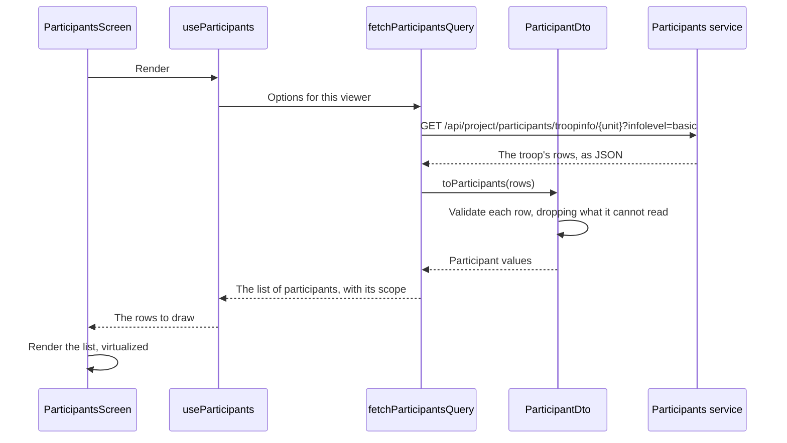

# Show participants

The first feature: a leader opens the participants section and sees the people in their unit. It is the flow every later module that fetches anything is built to look like, so it is worth reading twice. Locally, the [mock](../../testing/mock) serves the list of participants and the gates below.

## What the viewer is allowed to ask for

The participants service serves the list of participants one troop at a time and gates every answer by the caller's roles ([Applications](../applications)). There is no endpoint that returns everyone a person may see, so the client has to know who is reading before it can ask anything.

That is settled once, at the session gate: the signed-in identity is distilled into a viewer – the member number, the unit a leader leads, whether the whole list of participants is theirs to read, and whether the health answers are – and mounted above every screen ([Data layer](../layers/data)). A leader's viewer names one troop. The contingent management's names none, and reads everything.

## From the tap to the list

The screen asks a hook, the hook reads a query, and the query is the only thing in the module that knows a network exists. The sequence below is a leader opening their unit for the first time, with nothing in the cache.

## What each layer did

**The screen** rendered. It did not fetch, did not validate, and did not decide which troop to ask for – it called the hook beside it and drew what came back, including the empty and the failed states.

**The hook** connected the two. It reads the viewer from context, hands it to the query factory, and returns the rows and their state. It is the unit a test drives, and the reason the screen has nothing left in it worth a unit test.

**The query factory** described the request rather than making it. It names a stable key and the function that would fetch, so a route that prefetches, a component that reads, and a test that substitutes all share one definition – collapsed by the cache into a single request however many callers there are.

It also composes. A leader asks for their own troop and is done. The contingent management walks the list of participants the only way the service offers it: the leaders' listing names every troop, then each troop, the IST, and the management itself are fetched and merged by member number. An empty listing answers as if nothing is there, which for a composed list means no rows rather than a failure.

A listing that fails is retried once, alone. One that still fails fails the whole answer: the list's first job is answering "does this person exist", and a list quietly missing one unit answers that wrongly with full confidence. A visible failure with a way to try again is recoverable; a silent gap is not.

**The DTO and its converter** were the boundary. Every field arrived typed `unknown`, and the converter decided whether what came back is usable: a row with no member number cannot be linked to, so it is dropped; a member type the domain has no role for is dropped, because a person shown in the wrong role is worse than a person missing from a list. The rest of the list still renders.

The list of participants that comes back carries its own scope – everyone, one unit, or nobody – so the screen can say what it is showing rather than infer it from a row count.

**The list** is virtual. Every one of the contingent's roughly 2,600 people scrolls as one list, and only the rows near the viewport have DOM nodes, so a filter change costs the same at forty rows as at four thousand ([ADR 017](/decisions/017-route-and-load-data-with-tanstack-router-and-query)).

## Browsing by unit

The management also gets a way in by unit, for when the question is about a unit rather than a person. The unit browser is derived from the already-assembled list – the units it shows, the IST and the management entries beside them, and every count are groupings of what was fetched, so opening it costs no request. An entry opens as a scoped list, ordered as any other.

## Coming back to the list as it was

The search text and the participation-role filter live in the address as search params, changed with `replace` so typing does not pollute history. Returning from a person pops to an entry whose address still carries the narrowing, and the navigation memory restores the reading position into the same narrowed list – while a fresh arrival, from the menu or a typed address, opens clean.

## Opening one person

A row is a link to the person's own address, which carries the member number – the list's only stable key. The detail screen asks for the same person at the full information level, which adds the health and dietary answers.

The service refuses rather than quietly answering with less, and that refusal is useful: a caller who may see the person but not that much is told so, and the client asks again at the basic level. Telling a refusal from a person who is not there matters, because the service answers "outside your scope" and "does not exist" identically on purpose – so the list of participants does not leak who is in it.

That one retry is the whole reason the fetch wrapper in `libraries/utils` carries the status of a refusal instead of collapsing every failure into one error.

## Where the shape changes

The same person is a different type in each layer, and each boundary is exactly one transformation:

| Between                 | Turns            | Into             | Done by                 |
| ----------------------- | ---------------- | ---------------- | ----------------------- |
| Service and data        | JSON             | `ParticipantDto` | The fetch               |
| Data and domain         | `ParticipantDto` | `Participant`    | `toParticipant`         |
| Domain and presentation | `Participant`    | What a row shows | The hook, or the screen |

Nothing above the converter sees a wire field name, and nothing below the hook sees a formatted date – so a field renamed upstream stops at the converter, and a change to how a row reads stops at the screen.

## The next day, in a field

The second time the leader opens the section, the rows come from the cache. Data that arrived once is kept for a day before it is even considered stale and for thirty days before it is collected, refetching on mount, focus, and reconnect is off, and the query runs against the cache before it asks the network ([Data layer](../layers/data)). A phone with no connection at all opens on the list of participants it had.

Two costs come with that. A correction made in the list of participants can take a day to appear unless something asks for it, and no refresh control is specified. And the list of participants is composed one troop listing at a time – cheap for one unit, noticeably chattier for the whole contingent's fifty-three; the day that hurts is the day to ask the service for a listing that answers in one request.

## When it fails

| Failure                          | What happens                                                                      |
| -------------------------------- | --------------------------------------------------------------------------------- |
| A row does not convert           | That row is dropped, and the rest of the list is shown                            |
| The request never reached anyone | The cached list of participants is shown if there is one, and a failure if not    |
| The service refuses the listing  | The screen says the list of participants could not be read, not that it is empty  |
| One listing among many fails     | Retried once alone; still failing, the whole list reads as unreadable, with retry |
| The person is outside the scope  | The same answer as a person who does not exist – nothing to show                  |
