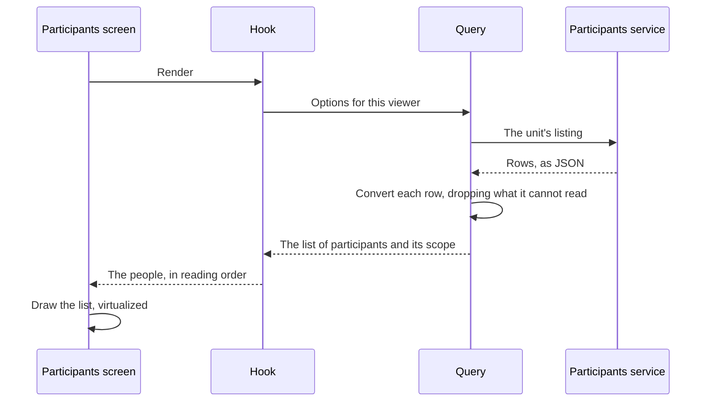

# Show participants

A leader opens the participants section and sees the people in their unit. Every module that fetches anything is built to look like this flow: a screen calls a hook, the hook reads a query, and only the query knows a network exists ([Layers](../layers/)). Locally, the [mock](../../testing/mock) serves the list of participants with the same access rules.

## What the viewer may ask for

The participants service lists one unit at a time and refuses what the caller may not read. It has no way to ask for "everyone I may see", so the client has to know who is reading before it can ask anything.

That is settled once, at the session gate. The signed-in person is distilled into a viewer – their member number, the unit a leader leads, whether the whole contingent is theirs to read, and whether health answers are – and mounted above every screen ([Data layer](../layers/data)). A leader's viewer names one unit. The contingent management team's names none, and reads everyone.

## From the tap to the list

The sequence below is a leader opening their unit with nothing in the cache.

1. **The screen renders.** It does not fetch, validate, or decide which unit to ask for. It calls the hook beside it and draws what comes back, including the empty and the failed states, so it holds no logic worth a unit test.
2. **The hook connects the two.** It reads the viewer, hands it to the query, and returns the people in reading order, their state, and a way to try again. It is what a test drives.
3. **The query describes the request rather than making it.** It is a stable key and the function that would fetch. A route that prefetches, a screen that reads, and a test that substitutes all share it, and the cache collapses them into one request however many callers there are ([ADR 017](/decisions/017-route-and-load-data-with-tanstack-router-and-query)).
4. **The converter is the boundary.** Every field arrives untyped. A row without a member number cannot be linked to, and a member type the domain has no role for would show a person in the wrong role, so both are dropped and the rest of the list still renders. The list that comes back carries its scope – everyone, one unit, or nobody – so the screen can say what it shows rather than infer it from a row count.
5. **The list is virtual.** The whole contingent scrolls as one list with only the rows near the viewport in the document, so a filter costs the same at forty rows as at thousands ([ADR 036](/decisions/036-virtualize-a-list-that-can-grow-to-the-contingents-size)).

## Where the shape changes

The same person has a different shape in each layer, and each boundary is one transformation:

| Between                 | Turns         | Into             |
| ----------------------- | ------------- | ---------------- |
| Service and data        | JSON          | A wire record    |
| Data and domain         | A wire record | A participant    |
| Domain and presentation | A participant | What a row shows |

Nothing above the converter sees a wire field name, and nothing below the hook sees a formatted date. A field renamed upstream stops at the converter, and a change to how a row reads stops at the screen.

## The whole contingent

The contingent management team reads everyone, which the service offers only one listing at a time. The leaders' listing names every unit, and then each unit, the IST, and the management are fetched and merged by member number. An empty listing is no rows, not a failure. Fetching the contingent this way costs many requests where a leader's unit costs one – the price of a service with no single listing for it.

A unit, IST, or management listing that fails is asked once more on its own. If it still fails, or the leaders' listing fails at all, the whole list fails with a way to try again. The list's first job is answering whether a person exists, and a list quietly missing a unit answers that wrongly with full confidence. A visible failure can be retried; a silent gap cannot.

The management also browses by unit, for when the question is about a unit rather than a person. The unit browser groups the same assembled list by unit, IST, and management, so opening it costs no request, and an entry opens as a list of its own.

## Narrowing and coming back

The search text and the participation-role filter live in the address, so a narrowed list can be shared and returned to. The address is replaced rather than pushed, because narrowing is not somewhere the reader went, and typing adds nothing to the history. Coming back from a person returns to the same narrowed list at the same reading position, while arriving from the menu opens it clean ([Navigation and routing](../layers/navigation)).

## Opening one person

A row links to the person's own address, keyed by member number – the list's only stable key. The detail asks for as much as the viewer may read: the full record, with the health and dietary answers, for a leader or a health grant, and the basic one for the rest of the management. A leader who also serves in the management and opens someone outside their unit is refused the full record, and the query asks once more at the basic level rather than reading the refusal as a failure.

The service answers a person outside the viewer's scope exactly as one who does not exist, so the list of participants never reveals who is in it, and the screen words both the same way.

## The next day, in a field

Opening the section again draws the cached list at once and asks for a fresh one behind it. If the fresh read fails, the cached list stays. Answers are kept for thirty days, so a phone with no connection opens on the list it had ([Data layer](../layers/data)).

| Failure                           | What the reader sees                                                   |
| --------------------------------- | ---------------------------------------------------------------------- |
| A row does not convert            | The rest of the list                                                   |
| No connection                     | The cached list, or a failure with a way to try again if there is none |
| A listing still fails after retry | That the list could not be read, never that it is empty                |
| The person is outside the scope   | The same as a person who does not exist                                |
| The session has ended             | The sign-in screen, in place ([Sign in](./sign-in))                    |
