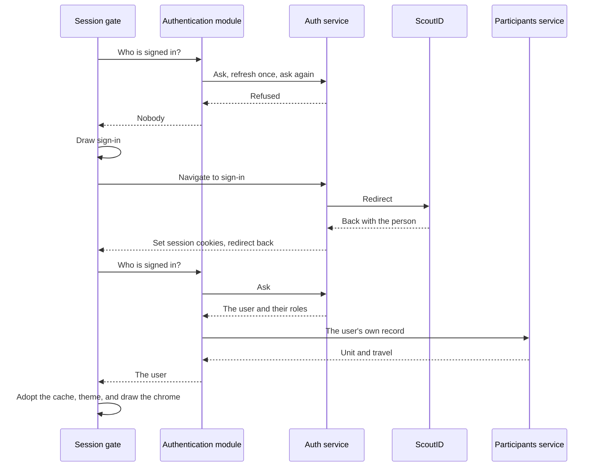

# Sign in

A leader opens Campfire, sees the sign-in screen, and taps the button. Signing in happens on the application's own origin and leaves it once, for ScoutID. The session it ends with is httpOnly cookies the web application never reads, so there is no token in the browser for an injected script to steal and no decision about where to store one ([ADR 019](/decisions/019-authenticate-on-the-app-origin-through-scoutid)). Locally, the [mock](../../testing/mock) answers the same contract, with a persona picker in place of ScoutID.

## The round trip

The sequence below is a browser with no session signing in and landing back in the application. The session gate is the part of the web application every screen sits behind.

1. **The gate asks.** The authentication module asks the auth service who is signed in. On a refusal it refreshes once and asks again, because the access token is short-lived on purpose and a returning person usually still holds a refresh cookie. Only when that also refuses is nobody signed in.
2. **The screen navigates.** Signing in is a full-page navigation carrying the address to come back to, not a fetch, because only a real navigation can leave the origin for ScoutID and return. The screen holds no form, no password, and no token.
3. **The auth service holds the secret.** It walks the OpenID round trip with ScoutID and sets the session cookies on the application's origin on the way back. It is the only part of the flow that involves a secret.
4. **The module completes the user.** The service's answer carries the roles. The person's own record in the list of participants adds how they travel, and their unit where the roles named none. A failure there leaves a user without those facts rather than no user.
5. **The gate opens.** It hands the query cache to this member number, wiping it first if someone else owned it, so a shared phone never serves one person's list of participants to the next. Then it mounts the user and the roles, dresses the application in the unit's color, and draws the chrome. Nothing renders while any of this is pending – no spinner, and no flash of sign-in past a signed-in person.

## Roles

The auth service reports roles as flattened, colon-separated strings. One table in the authentication module turns each into the closed set the application knows – leading a unit and which one, a function of the contingent management team, and the grant that opens health answers – and an unknown string grants nothing. Everything else asks through the role helpers and never reads a role string, so a change in the provider's spelling is a change to that one table.

Strings are compared segment by segment, never as a text prefix. `wsj27:cmtx` starts with the same characters as `wsj27:cmt` and is an unrelated role, and matching it would grant access nobody was given. The user and the roles are readable anywhere below the gate ([ADR 032](/decisions/032-hold-the-signed-in-person-in-utils)).

## When signing in fails

At boot, anything but a user reads as "nobody is signed in", and the screen behind that is the same one:

| Failure                               | What the person sees                                    |
| ------------------------------------- | ------------------------------------------------------- |
| No session, and no refresh cookie     | The sign-in screen                                      |
| No connection                         | The sign-in screen, since signing in proves the link    |
| No auth service behind the origin     | The sign-in screen – the answer is a page, not a person |
| An answer the module cannot decode    | The sign-in screen, rather than a crash in the gate     |
| ScoutID refused or the person gave up | The sign-in screen, ready to try again                  |

Reading an unreachable service as signed out is a deliberate simplification. The screen would decide the same either way, and the answer crosses a service boundary, so a shape the module does not recognize must not take the application down.

## Inside a shell

A shell's part in sign-in is a shared cookie jar. It cancels a navigation to the identity provider in the main webview and reopens it in a modal sheet – a sheet on Apple, a modal bottom sheet on Android – on a webview that shares the shell's cookie store. The cookies the auth service sets on the way back land where the main webview reads them. When the round trip returns to the application's origin, the sheet closes and the page reloads into the new session. A link out of the flow opens in the system browser, and signing out takes the same route ([ADR 019](/decisions/019-authenticate-on-the-app-origin-through-scoutid)).

Two details are easy to get wrong and slow to debug. The identity webview carries no `CampfireShell` marker in its user agent, because ScoutID is an ordinary web site rather than the hosted application. And the local origin is spelled `localhost` – never `127.0.0.1` or the emulator's host alias – because cookies do not cross between spellings of one machine, and ScoutID returns only to the one host name it knows.

## Staying signed in

The auth service ships its own keep-alive script, which the application loads once per page. It watches a readable expiry cookie and refreshes the session ahead of expiry, so an active person is never bounced to sign-in mid-task.

When a refresh is refused the script stops silently, so the application watches the same cookie for the one thing the script cannot tell it. Shortly after the time the cookie names, and whenever the page becomes visible again, a cookie that was not renewed makes the authentication module ask again. A read refused with 401 asks the same question from the query client ([ADR 033](/decisions/033-recover-an-ended-session-at-the-query-client-and-the-gate)).

Mid-use, only the service saying no ends a session, because ending one forgets the cache an offline phone depends on. That is the one difference from boot, where the sign-in screen forgets nothing and any doubt may read as signed out:

| The answer      | What happens                                                                       |
| --------------- | ---------------------------------------------------------------------------------- |
| The same person | The refused read runs once more, and the screen never sees the failure             |
| No answer       | Nothing changes – the read fails as any network failure does, and the cache stays  |
| Nobody          | The cache is forgotten, and sign-in is shown in place, so signing in returns there |
| Another person  | The page reloads, and the gate adopts the new owner as it does at boot             |

A read refused with 403 or 404 asks nothing, because those are the module's own answers to word ([Data layer](../layers/data)). A page restored from the back-forward cache reloads, because it comes back drawn for whatever session it had when it was frozen, and asking again is simpler than reasoning about that.

## Signing out

Signing out is offered on the profile page. The application forgets its cache first, then navigates to the auth service's sign-out, which ends the session and the ScoutID one with it, and lands back on the sign-in screen. It leaves whether or not the cache could be cleared, so a browser that refuses its own storage cannot hold anyone inside a session.
