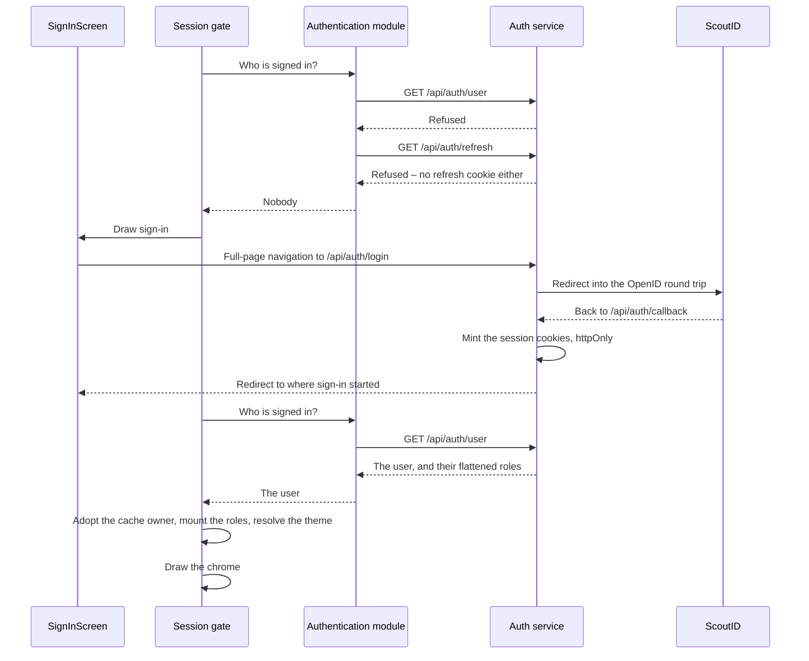

# Sign in

One tap, followed through every layer. A leader opens Campfire, sees the sign-in screen, and taps the button.

The page follows the contract this repository consumes ([ADR 019](/decisions/019-authenticate-on-the-app-origin-through-scoutid)) and the client the application meets it with. Locally, the [mock](../../testing/mock) answers the whole `/api/auth` contract, with a stand-in for ScoutID that shows a persona picker.

## The round trip

The whole of signing in happens on the application's own origin, and leaves it exactly once. The sequence below is a browser signing in with no session: the gate asks, the person taps, the auth service walks the round trip with ScoutID, and the application boots again with cookies it never sees.

## What each piece did

**The screen** navigated, and that is all it did. Signing in is a full-page navigation to `/api/auth/login` with the address to come back to, not a fetch – the round trip leaves the origin for ScoutID and returns, and only a real navigation can carry that. The screen holds no form, no password, and no token.

**The authentication module** owns the addresses and the question. It builds the sign-in and sign-out URLs, asks `/api/auth/user` who is signed in, and decodes the answer defensively: the payload crosses a service boundary, so a shape the module does not recognize reads as signed out rather than as a crash in the gate.

One refusal is not the end. The access token is short-lived on purpose, so a returning session usually holds a live refresh cookie: the module makes one `/api/auth/refresh` round trip and asks again. Only when that also refuses is nobody signed in.

**The auth service** did the only part that involves a secret. It redirects to ScoutID, receives the return leg at `/api/auth/callback`, and mints the session there – httpOnly cookies on the application's own origin. The web application never sees a token, which is why it never stores one and never has to decide where to ([Applications](../applications)).

**The gate** turned a user into a session. In order: hand the cache its new owner before any screen mounts, so a previous person's cached list of participants is gone before a query reads it; mount the session's roles and the signed-in user for everything below; resolve the theme; then draw the chrome. Nothing renders while the service is still answering.

**The role translation** is the one place the provider's spellings are read. The service reports the roles flattened, as a colon-separated hierarchy, and one table turns each spelling into the closed set the application knows – leading a unit and which one, the management and its functions, the grant that opens the health answers in the list of participants – with an unknown spelling granting nothing. The set is what travels: mounted at the gate, readable anywhere below, so a screen asks it with the helpers and never reads a role string. One table rather than scattered checks, because what the provider reports is in flux – swapping the provider's shape is that one table.

Roles are compared segment by segment, never with a string prefix. `wsj27:cmtx` starts with `wsj27:cmt` as text and is an unrelated role, and treating it as a match would grant access nobody was given.

## Inside a shell

The same round trip, with one difference that the shells exist to provide: a cookie jar the whole flow shares.

A navigation to a configured identity origin is canceled in the main webview and reopened modally – a sheet on Apple, a modal bottom sheet on Android – on a webview that shares the shell's cookie jar. That sharing is the entire point: the cookies the auth service sets on the way back through the callback land where the main webview will read them. When the round trip returns to an ordinary app-origin URL the sheet closes, and the page underneath reloads and picks up the new session.

Two details are easy to get wrong and expensive to debug. The identity webview carries no `CampfireShell` token, because the identity provider is an ordinary web site rather than a hosted app. And cookies live on `localhost` specifically – not `127.0.0.1`, not the emulator's host alias – because a session's cookies do not cross between spellings of the same machine, and ScoutID only returns to the one host name it has registered.

## Staying signed in

The auth service ships its own keep-alive script. The application loads it once per page, and it watches a public expiry cookie and refreshes the session while the app is open, so an active person is never bounced back to sign-in mid-task.

A restore from the back-forward cache is treated as a reason to start over: it hands back a fully rendered application with whatever session it had when it was frozen, and re-asking is cheaper than reasoning about that.

## When it fails

Every failure reads as "nobody is signed in", and the screen behind that is the same one:

| Failure                            | Where it is seen                               | What the person sees                            |
| ---------------------------------- | ---------------------------------------------- | ----------------------------------------------- |
| No session, and no refresh cookie  | Both requests refused                          | The sign-in screen                              |
| No connection                      | The request never reached anything             | The sign-in screen – signing in proves the link |
| Nothing behind `/api/auth` at all  | The answer is a page rather than JSON          | The sign-in screen                              |
| A payload the module does not know | The defensive decode                           | The sign-in screen, rather than a crash         |
| ScoutID refused the sign-in        | The round trip returns without minting cookies | The sign-in screen, ready to try again          |

Reading a network failure as "signed out" is a deliberate simplification: the screen behind it decides the same thing either way, and signing in is what proves the connection works.

Signing out starts on the profile page, the one place that offers it: the application forgets its query cache, and then the same mechanism runs in reverse – a full-page navigation to `/api/auth/logout`, which drops the session and signs out of ScoutID too, and in a shell it walks through the same modal flow.
