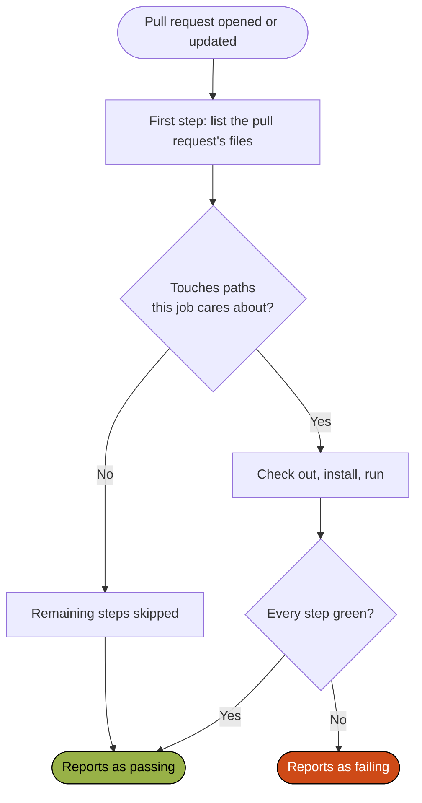

# Continuous integration

Every check that guards Campfire runs on a developer's own machine first, through [the git hooks](./checks). Continuous integration runs the same checks again on the server, on every pull request, so nothing reaches `main` without passing them. It is where the best-effort local checks become a hard gate, and [ADR 009](/decisions/009-check-and-release-with-small-github-actions-workflows) is where its shape was decided.

The workflows live in `.github/workflows/`, on GitHub Actions – the same place the code, the issues, the pull requests, the releases, and the guidebook's hosting already are. There are eleven of them, each single-purpose, and each named for what it does: a `check_*` workflow validates without building, a `build_*` workflow compiles one output to prove it compiles, a `test_*` workflow runs a suite, and a `release_*` workflow ships one output and is the only kind that writes anywhere.

## Four rules give them their shape

- **A check filters inside the job, never with `on: paths:`.** This is the important one. A workflow skipped by a path filter reports no status at all, and a required status check waits on that status forever; a job skipped by an `if:` reports as passing. So every check triggers on every pull request, asks in its first step whether the change touches anything it cares about, and skips the rest of the job when it does not.
- **Every check reports separately.** `check.yml` runs one step per check script, each executing even after a sibling failed, so one run reports every problem rather than the first.
- **Least privilege, declared explicitly.** A read-only workflow says `contents: read` – plus `pull-requests: read` where it asks the API which files changed – rather than inheriting the repository default, and a release scopes its write permission to the job that needs it: `packages: write` to publish an image, `pages: write` and `id-token: write` only on the deploy job.
- **Pull request runs cancel on supersede; releases queue and never cancel.** A canceled check wastes nothing. A canceled release can leave a tag without the artifact it names.

The flow below is what a check workflow does on every pull request: it asks the API which files changed, and either runs or reports as passing without doing the work.

The change detection is its own step rather than an inline condition, so a failed API call fails the job instead of reading as "nothing changed" and quietly skipping the work. Every filter includes the workflow's own file, so a change to how a job runs is checked by that job.

## The workflows

| Workflow                 | Trigger                                                                               | What it does                                                                                  |
| ------------------------ | ------------------------------------------------------------------------------------- | --------------------------------------------------------------------------------------------- |
| `check.yml`              | Every pull request, unfiltered                                                        | The four checks and `pnpm test`, one step each, each running even after a sibling failed      |
| `test_web.yml`           | Pull requests touching a module, the web application, a library, or the tooling       | One job per module, each running that module's Playwright walk-through                        |
| `build_web.yml`          | Pull requests touching the web application, modules, libraries, or the image files    | `pnpm build:web` and `pnpm build:storybook`, and the image unpublished when its files changed |
| `build_guidebook.yml`    | Pull requests touching `docs/`, the agent definitions, or the VitePress configuration | `pnpm build:guidebook`                                                                        |
| `build_android.yml`      | Pull requests touching `apps/android/`                                                | `./gradlew assembleLocalDebug` on Temurin 25                                                  |
| `check_android.yml`      | Pull requests touching `apps/android/`, Detekt's config, or `.editorconfig`           | ktlint, Detekt and Android Lint, the JVM tests, and the instrumented compile                  |
| `check_architecture.yml` | Pull requests touching `docs/architecture/` or `scripts/structurizr/`                 | `pnpm check:arch`                                                                             |
| `check_skills.yml`       | Pull requests touching `.agents/skills/`                                              | Validates each skill's frontmatter, its links, and that a changed skill bumped its version    |
| `release_web.yml`        | Push to `main` touching the web application; also by hand                             | Builds the image and publishes it to `ghcr.io`                                                |
| `release_skills.yml`     | Push to `main` touching `.agents/skills/`; also by hand                               | One GitHub Release per skill whose version has not been released                              |
| `release_guidebook.yml`  | Push to `main` touching `docs/` or the agent definitions; also by hand                | Builds the site and deploys it to GitHub Pages                                                |

Four of them deserve a note on what they actually prove.

`test_web.yml` is a matrix over the four modules – `authentication`, `home`, `journey`, and `participants` – and each job asks its own question: does this pull request touch that module, the web application, a library, or the tooling underneath them? A change to one module runs one walk-through. The matrix is `fail-fast: false`, so a failure in one module does not cancel the other three, and the same four names in the same order are the `projects` list in `config/playwright/playwright.config.ts` – a module added to one and not the other either runs nowhere or fails with "no project named X". The Chromium download is cached on the Playwright version, and a failed run uploads its traces.

`build_web.yml` builds Storybook as well as the application, so a story that no longer bundles fails the pull request. It is a build, not a render: it catches the import that broke rather than the pixel that moved. When the Dockerfile, the image's Caddyfile, or `.dockerignore` changed, it also builds the image the way `release_web.yml` does and stops short of publishing it, so a broken image fails the pull request rather than the release after the merge.

`check_android.yml` compiles the instrumented test suite without running it. Emulators on hosted runners are slow enough and flaky enough to cost more attention than they save, so the compile catches the drift and a human runs `pnpm test:android:ui` when it matters. It uploads Gradle's reports as an artifact when it fails, because a lint finding is unreadable from a log line.

`check_skills.yml` is the one check with no local counterpart. It reads each skill's frontmatter, resolves every link in its `SKILL.md`, and – this is the point of it – fails a pull request that changed a skill's content without bumping its `metadata.version`, because `release_skills.yml` skips a version whose tag already exists and the change would otherwise silently never ship ([ADR 025](/decisions/025-publish-agent-skills-as-versioned-releases)).

## What a release means here

The version in `package.json` is the trigger. `release_web.yml` always publishes `:main` and `:sha-<short>` on every merge – for rollback, and for pointing a deployment at one exact commit – and additionally publishes `:<version>` and `:latest` when the git tag `web-v<version>` does not yet exist. It creates that tag last, so the tag exists only once the image it names is actually published. Bumping the version is therefore what cuts a release, and re-releasing means deleting the tag. The skills work the same way, keyed on `metadata.version` instead.

The image is built for `linux/amd64` and only for amd64 – the cluster's platform ([ADR 026](/decisions/026-publish-the-web-application-as-a-container-image)) – on a plain `ubuntu-24.04` runner. The Dockerfile's build stage runs on the builder's own platform whatever the target, so the pnpm install and the Vite build never run under emulation, there or on a developer's Apple-silicon machine.

`release_guidebook.yml` publishes this guidebook to GitHub Pages on every merge that touches `docs/` or an agent definition ([ADR 029](/decisions/029-render-the-guidebook-with-vitepress)). It is two jobs – build, then deploy – so the deploy job is the only thing holding `pages: write`, and its concurrency group is `pages` with canceling switched off, because a canceled deploy can leave the site half-published.

Nothing deploys the application. Publishing to `ghcr.io` is where that pipeline ends: the direction for where the image runs is recorded ([ADR 027](/decisions/027-run-the-back-end-on-kubernetes-in-azure)), the dev cluster is handed the image by hand, and this workflow assumes no host.

## What is missing

- **There is no Apple continuous integration at all.** Not an oversight: a macOS runner bills at several times the rate of a Linux one, and the shell is thin enough that the `pre-push` hook is the trade worth making. It means a Swift change is only ever checked on the machine that made it.
- **Nothing checks that the diagrams match the model.** `check_architecture.yml` runs `pnpm check:arch`, which validates and inspects the workspace; nothing compares the committed SVGs against it. Re-export after a model change and read the diff.
- **Nothing checks that the version moved.** A `feat` merged without a version bump publishes `:main` and its sha and cuts no release, silently. The rule is written down in the [conventions](./conventions) and enforced by nobody.
- **Releases trust the pull request gate** rather than re-validating on `main`. That holds while one person merges one change at a time onto an up-to-date branch, and stops holding the day two changes pass alone and break together.
