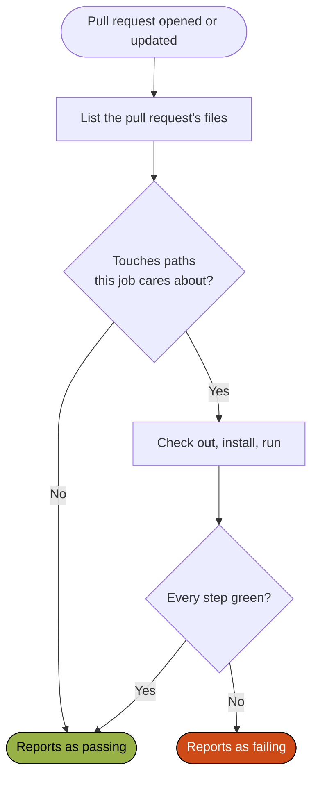

# Continuous integration

Every check runs on a developer's machine first, through [the git hooks](./checks#the-git-hooks). Continuous integration runs them again on GitHub Actions, on every pull request, so nothing reaches `main` without passing them – the local hook is best effort, and this is the hard gate. After a merge, the same workflows ship what changed.

The workflows in `.github/workflows/` are small and single-purpose, and the prefix of each name says what kind it is ([ADR 009](/decisions/009-check-and-release-with-small-github-actions-workflows)). Checking and shipping want different triggers, permissions, and failure behavior, so they never share a workflow.

| Kind        | Runs on                      | What the workflows do                                                                                                                                                 |
| ----------- | ---------------------------- | --------------------------------------------------------------------------------------------------------------------------------------------------------------------- |
| `check_*`   | Pull requests                | Validate without building – the shared checks and `pnpm test`, the Android checks and JVM tests, the architecture model, and the agent skills                         |
| `test_*`    | Pull requests                | Walk each module's screens in a browser, one job per module ([ADR 024](/decisions/024-walk-through-the-web-application-per-module-with-playwright))                   |
| `build_*`   | Pull requests                | Build the web application and Storybook, the container image when its files changed, the guidebook, and the Android shell – proof that each builds, published nowhere |
| `release_*` | Merges to `main`, or by hand | Publish the web image and move `:dev` to it, publish each agent skill whose version is new, and deploy the guidebook to GitHub Pages                                  |
| `promote_*` | By hand, naming a version    | Move `:prod` to an image that is already released                                                                                                                     |

Only releases and promotions write anywhere.

## How a check decides to run

A check that concerns only part of the repository still triggers on every pull request, and decides inside the job whether the change touches that part. A workflow skipped by a path filter reports no status at all, and a required check waits on that status forever, while a job whose steps are skipped reports as passing. A release, which nothing waits on, filters at its trigger instead.

The flow below is what a check does on each pull request.

The file listing is a step of its own, so a failed API call fails the job instead of reading as "nothing changed" and skipping the work. Every filter includes the workflow's own file, so a change to how a job runs is checked by that job.

The rules that hold across the workflows:

- **Every check reports separately.** Each check is its own step and runs even after a sibling failed, so one run reports every problem rather than the first.
- **Least privilege.** A read-only workflow declares `contents: read`, and a write permission is scoped to the one job that needs it.
- **Pull request runs cancel when superseded; releases and promotions queue and never cancel**, because a canceled release can leave a tag without the image it names.

## What the checks prove

- **The walk-throughs** run one job per module, and each asks whether the change touches that module, the web application, a library, or the tooling beneath them. A change to one module walks only that module – except authentication, which every walk signs in through, so a change there walks them all. One module's failure does not cancel the others, and a failed walk uploads its traces.
- **The web build** includes Storybook, so a story that no longer bundles fails the pull request. When the Dockerfile or the image's Caddy configuration changed, it also builds the image the way the release does and stops short of publishing it, so a broken image fails the pull request rather than the release after the merge.
- **The Android check** runs ktlint, Detekt, Android Lint, and the JVM tests, and compiles the instrumented tests without running them, so they cannot rot unnoticed. A failed run uploads Gradle's reports, because a lint finding is unreadable from a log line.
- **The skills check** has no local counterpart. It validates each skill's frontmatter and links, and fails a pull request that changed a skill without bumping its version, because the skills release skips a version that is already tagged and the change would otherwise never ship ([ADR 025](/decisions/025-publish-agent-skills-as-versioned-releases)).

## Releasing the web

A merge is a release when its commits earn one, so nobody has to remember to cut it. On a merge that touches the web, `release_web.yml` works out the next version from the commits since the last `web-v` tag ([ADR 034](/decisions/034-version-each-artifact-from-its-own-commits)), publishes the image, tags the version once the image exists, and moves `:dev` to it. `promote_web.yml` is started by hand and moves `:prod` to a version that is already released, without rebuilding it ([ADR 035](/decisions/035-promote-the-web-by-moving-environment-tags)). [Release](../maintenance/release) describes the versions, the image tags, and promotion in full.

Moving `:dev` and moving `:prod` are recorded as GitHub deployments in the `dev` and `prod` environments, each linked to the site it serves, so the repository's Deployments page is the history of what ran where.

The pipeline ends at the tag. Neither workflow touches the cluster or holds credentials for it – the cluster takes what a tag points at, by a step its operators own ([ADR 027](/decisions/027-run-the-web-beside-the-back-end-on-scouternas-cluster)). The image is built for `linux/amd64` only, the cluster's platform, while the build stage runs on the builder's own platform, so the install and the Vite build never run under emulation ([ADR 026](/decisions/026-publish-the-web-application-as-a-container-image)).

The skills and the guidebook release the same way, on a merge that touches them. A skill is released when its `metadata.version` has no tag, because a skill's version tracks its content rather than the commits ([ADR 025](/decisions/025-publish-agent-skills-as-versioned-releases)). The guidebook is built and then deployed to GitHub Pages in a separate job, so only the deploy holds the permission to publish ([ADR 029](/decisions/029-render-the-guidebook-with-vitepress)).

## What is not covered

- **No Apple continuous integration.** A macOS runner bills far above a Linux one, and the shell is thin, so the `pre-push` hook is the Swift gate. A Swift change is checked only on the machine that made it ([ADR 008](/decisions/008-check-commits-with-git-hooks)).
- **No emulator.** The Android instrumented tests are compiled but not run, because emulators on hosted runners are slow and flaky. `pnpm test:android:ui` runs them locally.
- **No diagram check.** `check:arch` validates the model, but nothing compares the committed SVGs with it, so re-export after a model change and read the diff.
- **No check that dev ran a version before it is promoted.** Promoting a version dev never had is visible on the Deployments page, but not refused.
- **No re-validation on `main`.** Releases trust the pull request gate. That holds while one change at a time is merged onto an up-to-date branch, and stops holding when two changes pass alone and break together.
