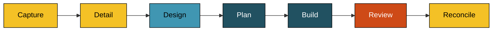

# Process

Campfire is built by humans deciding what it should do next, and AI agents doing the work those decisions imply. This chapter describes how that runs: who decides what, what the agents actually do, and the order it happens in.

## Who decides

Humans do. All of it.

What Campfire should do, which features are worth building, how the system is put together, how it looks and behaves – every one of those is decided by the humans building it. The agents do not make those calls, and nothing an agent writes is settled until a human says so.

What the agents are for is the work between decisions. Once a human knows what they want, it still has to become an issue precise enough to track, requirements precise enough to build against, a design that holds together, a plan, the code itself, and a careful reading of the result. That is the part the agents do, and they do it quickly and thoroughly.

So an agent's output is always a draft. It goes back for a human to accept, change, or discard, and the work does not move on until they have. Where an agent has had to guess, it says so rather than quietly deciding – an assumption presented as a fact is the one failure that would undermine all of this.

Two things the agents never touch at all: creating branches, and committing. The git history is the human's, and so is the working context – whichever tree the work started in is the tree it ends in. An agent may fan genuinely independent work out to several copies of itself and write the results back, which changes how fast the work goes and nothing about who decides; the rules for that are in [ADR 031](/decisions/031-adopt-the-agent-driven-working-process).

## The agents

An agent here is a written definition – its role, the single job it does, how it goes about it, and what it must never do. The agent reads that document before it starts work, so the definition is not a description of the agent; it is the agent. Following one shows exactly what it will and will not do, in the words it was given.

::: info Read by Claude Code and GitHub Copilot
An agent definition is plain Markdown carrying nothing but a name and a description, so any harness can read one. Claude Code runs them as subagents, GitHub Copilot as custom agents, both from the same file. Whatever only one harness understands – a tool list, a skill loaded up front – stays out of the definition and goes in its prose instead.
:::

| Agent     | What it does                                                                                                                           | Definition                          |
| --------- | -------------------------------------------------------------------------------------------------------------------------------------- | ----------------------------------- |
| Analyst   | Turns what a human wants into a tracked issue, and later into numbered requirements precise enough to build and test against           | [`analyst.md`](/agents/analyst)     |
| Architect | Works through the technical decisions humans have made, writes the design that follows from them, and records the durable ones as ADRs | [`architect.md`](/agents/architect) |
| Developer | Turns the approved design into a plan, then writes the code and tests that follow it                                                   | [`developer.md`](/agents/developer) |
| Reviewer  | Reads the result critically, hunting for bugs, and walks a human through it file by file before anything is committed                  | [`reviewer.md`](/agents/reviewer)   |

Each does a single job, so the agent that writes something is never the agent that judges it.

## The flow

Each step produces one named output, so what "done" means is never in doubt.

| Step      | Agent     | Output                                                                      |
| --------- | --------- | --------------------------------------------------------------------------- |
| Capture   | Analyst   | A GitHub issue – lean, and tracked                                          |
| Detail    | Analyst   | `requirements.md` – numbered requirements with testable acceptance criteria |
| Design    | Architect | `design.md`, plus any ADRs and guidebook updates the decisions call for     |
| Plan      | Developer | `plan.md` – tasks traced to requirements, with checkpoints                  |
| Build     | Developer | The code and its tests, left in the working tree                            |
| Review    | Reviewer  | The findings, and a file-by-file walkthrough before committing              |
| Reconcile | Analyst   | The issue updated to match what was actually built                          |

Between every step a human reads what came out and decides whether it is right. That is not one sign-off at the end but a checkpoint at each handoff, so a misunderstanding surfaces while it is still one document wide rather than after it has been built.

The requirement numbers thread through everything after them, so any part of the design or the code can be traced back to the need it serves.

## What lasts and what does not

The requirements, the design, and the plan are working scratch. They carry one piece of work while it is in flight, live in a folder per branch, and stay out of the committed history.

The durable record is the issue, the [decisions](/decisions/), this guidebook, and the code. Those are what someone reads in two years to understand why Campfire works the way it does – so the reasoning that outlives a branch goes there, and the in-flight scratch does not.

When a human settles something significant – a language, a framework, a data store, an approach that closes off alternatives – the Architect records it as an Architecture Decision Record. An accepted ADR is never rewritten; a decision that changes is superseded by a new one, so the history of the thinking stays intact.

## Not every change needs all of it

The full flow is for work substantial enough to be worth designing and planning. A one-line task or a contained bug goes straight from issue to change. Matching the ceremony to the size of the work is part of the process, not a departure from it.

## Where the detail lives

This chapter is the shape. The operational detail – conventions, commands, labels, and the full per-role instructions – lives in the `AGENTS.md` files (the root one, and one beside each area of the code) and in the agent definitions linked above. Where this chapter and those ever disagree, they govern.
