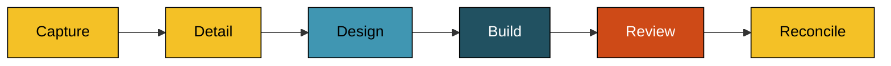

# Process

Campfire is built by humans deciding what it should do, and by AI agents doing the work those decisions imply ([ADR 031](/decisions/031-adopt-the-agent-driven-working-process)).

## Who decides

Humans do, all of it. What Campfire should do, which features are worth building, how the system is put together, and how it looks and behaves are human calls. Nothing an agent writes is settled until a human says so.

The agents do the work between decisions. Once a human knows what they want, it still has to become an issue precise enough to track, requirements precise enough to build against, a design that holds together, the code, and a careful reading of the result. An agent hands each of these back as a draft for a human to accept, change, or discard, and the work does not move on until they have. Where an agent has had to guess, it says so rather than deciding quietly, because an assumption presented as a fact is the failure that would undermine the rest.

## The agents

An agent is a written definition: its role, the one job it does, how it goes about it, and what it must never do. The agent reads it before it starts, so the definition is not a description of the agent – it is the agent. Each does a single job, so the agent that writes something is never the one that judges it.

| Agent                          | Its job                                                                                               |
| ------------------------------ | ----------------------------------------------------------------------------------------------------- |
| [Analyst](/agents/analyst)     | Turns a need into a tracked issue, then into numbered requirements, and later reconciles the issue    |
| [Architect](/agents/architect) | Works out how to build it, writes the design, and records the lasting decisions as ADRs               |
| [Developer](/agents/developer) | Writes the code and tests the approved design calls for, and takes on small or exploratory work alone |
| [Reviewer](/agents/reviewer)   | Hunts for bugs, walks a human through the change file by file, and drafts the commit and pull request |

::: info Read by Claude Code and GitHub Copilot
A definition is plain Markdown carrying only a name and a description, so any harness can read it. Claude Code runs it as a subagent and GitHub Copilot as a custom agent, both from the same file. Whatever only one harness understands, such as a tool list, stays out of the definition and goes in its prose instead.
:::

## The flow

The work moves through steps that each produce one named output, so what "done" means is never in doubt. The chart shows the steps in order, each colored by the agent that carries it.

| Step      | Agent     | Output                                                                                        |
| --------- | --------- | --------------------------------------------------------------------------------------------- |
| Capture   | Analyst   | A GitHub issue – lean, and tracked                                                            |
| Detail    | Analyst   | `requirements.md` – numbered requirements with testable acceptance criteria                   |
| Design    | Architect | `design.md`, plus the ADRs and guidebook changes the decisions call for                       |
| Build     | Developer | The code and its tests, left in the working tree                                              |
| Review    | Reviewer  | The findings, a file-by-file walkthrough, and the commit message and pull request description |
| Reconcile | Analyst   | The issue rewritten to say what was actually built                                            |

Between every step a human reads what came out and decides whether it is right. That is a checkpoint at each handoff rather than one sign-off at the end, so a misunderstanding surfaces while it is one document wide, before it has been built.

The requirement numbers thread through everything after them. The design and the code cite them, so any part of either traces back to the need it serves.

Not every change needs all of it. The full flow is for work substantial enough to be worth specifying and designing, and every gate costs the human a review. A one-line task or a clear bug goes straight from the issue to the change, with the Developer taking on whatever else the work needs at the size it needs.

The issues are followed on the WSJ27 project together with the other WSJ27 repositories. What Campfire needs from one of those starts as a draft on the project, and becomes an issue in that repository once someone picks it up.

## What the agents never do

Agents never create a branch and never commit. The git history is the human's, and so is the working context – the tree the work started in is the tree it ends in.

An agent may fan genuinely independent work out to subagents of its own type, such as reading unrelated sources or building parts that touch separate files. The results come back to it as content, it writes every file and judges every finding itself, and the gates stay where they are. Spawning another role is ruled out, because that would be an agent arranging its own approval.

## What lasts

The requirements and the design are working scratch. They carry one piece of work while it is in flight, live in a folder per branch under `.agents/specs/`, and are never committed.

What outlives a branch is the issue, the [decisions](/decisions/), this guidebook, and the code. Those are what someone reads later to understand why Campfire works the way it does, so the reasoning goes there. When a human settles something significant – a framework, a data store, an approach that closes off alternatives – the Architect records it as an ADR. What an accepted ADR decided never changes in place; a decision that changes is superseded by a new record, so the history of the thinking stays intact ([ADR 001](/decisions/001-record-architecture-decisions)).

The operational detail – conventions, commands, and labels – lives in the `AGENTS.md` files, the root one and one beside each area of the code, and in the agent definitions. Where they and this chapter disagree, they govern.
